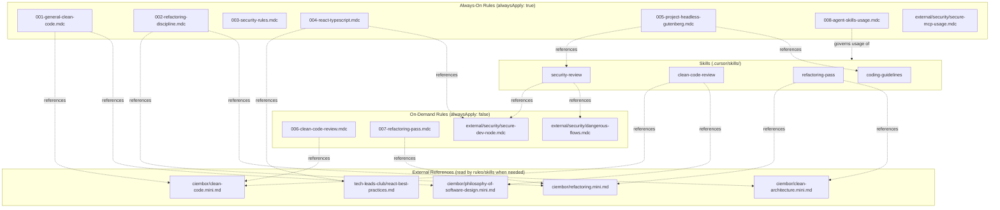
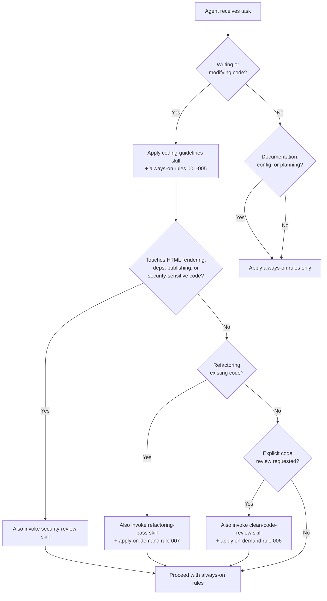

# Agent Rules and Skills Architecture

Comprehensive guide to the rules and skills infrastructure in this repository.

Primary audience: AI coding agents. Secondary audience: human developers.

For external source provenance and maintenance policy, see [agent-rules-sources.md](agent-rules-sources.md).

## Architecture Overview

## Design Principles

1. **No duplication between layers.** Always-on rules set the floor. Skills and on-demand rules add depth for specific tasks. External references provide detail when pulled in.
2. **Context budget awareness.** Only rules that apply to every task are `alwaysApply: true`. Specialized rules use `alwaysApply: false` or are passive references.
3. **Clear ownership.** Each topic (security, clean code, refactoring) has one always-on rule, one on-demand rule, one skill, and one or more external references. They don't repeat each other.

## Complete Rules Inventory

### Always-on rules

| File | Path | Purpose |
|------|------|---------|
| `001-general-clean-code.mdc` | `.cursor/rules/` | Clean code baseline: simple code, small functions, descriptive names, no hidden failures |
| `002-refactoring-discipline.mdc` | `.cursor/rules/` | Refactoring safety: preserve behavior, small changes, run tests, explain changes |
| `003-security-rules.mdc` | `.cursor/rules/` | Security: no secrets, input validation, maintained deps, HTML as unsafe, sanitization required |
| `004-react-typescript.mdc` | `.cursor/rules/` | React/TS: strict types, no `any`, named exports, peer deps, RTL testing |
| `005-project-headless-gutenberg.mdc` | `.cursor/rules/` | Project: phase awareness, architecture constraints, testing expectations |
| `008-agent-skills-usage.mdc` | `.cursor/rules/` | Skills: when and how to invoke project skills |
| `secure-mcp-usage.mdc` | `.cursor/rules/external/security/` | MCP: no auto shell commands from MCP servers, no PII to MCP, no auto file edits from MCP output |

### On-demand rules

| File | Path | Trigger |
|------|------|---------|
| `006-clean-code-review.mdc` | `.cursor/rules/` | Explicit code review tasks |
| `007-refactoring-pass.mdc` | `.cursor/rules/` | Explicit refactoring tasks |
| `secure-dev-node.mdc` | `.cursor/rules/external/security/` | Glob-triggered on `.ts`, `.tsx`, `.js` files |
| `dangerous-flows.mdc` | `.cursor/rules/external/security/` | When testing code for dangerous/insecure flows |

### Relationship between always-on and on-demand rules

| Always-on | On-demand | Relationship |
|-----------|-----------|-------------|
| `001-general-clean-code.mdc` | `006-clean-code-review.mdc` | 001 sets the floor; 006 is invoked for explicit review tasks |
| `002-refactoring-discipline.mdc` | `007-refactoring-pass.mdc` | 002 sets guardrails; 007 is invoked for dedicated refactoring passes |
| `003-security-rules.mdc` | `secure-dev-node.mdc` / `dangerous-flows.mdc` | 003 sets the security baseline; on-demand rules provide deep analysis tools |

## Complete External References Inventory

| File | Path | Source repo | Content |
|------|------|-------------|---------|
| `clean-code.mini.md` | `.cursor/rules/external/ciembor/` | ciembor/agent-rules-books | Clean Code by Robert C. Martin |
| `refactoring.mini.md` | `.cursor/rules/external/ciembor/` | ciembor/agent-rules-books | Refactoring by Martin Fowler |
| `clean-architecture.mini.md` | `.cursor/rules/external/ciembor/` | ciembor/agent-rules-books | Clean Architecture by Robert C. Martin |
| `philosophy-of-software-design.mini.md` | `.cursor/rules/external/ciembor/` | ciembor/agent-rules-books | A Philosophy of Software Design by John Ousterhout |
| `react-best-practices.md` | `.cursor/rules/external/tech-leads-club/` | tech-leads-club/agent-skills | Vercel React performance optimization index (57 rules) |

## Complete Skills Inventory

| Skill | Path | When to invoke | Adds depth to |
|-------|------|----------------|---------------|
| `coding-guidelines` | `.cursor/skills/coding-guidelines/SKILL.md` | Implementation tasks, code changes, bug fixes, feature development | LLM behavioral correction (complements 001/002) |
| `clean-code-review` | `.cursor/skills/clean-code-review/SKILL.md` | Explicit code readability review | 001 + 006 |
| `refactoring-pass` | `.cursor/skills/refactoring-pass/SKILL.md` | Behavior-preserving refactoring of existing code | 002 + 007 |
| `security-review` | `.cursor/skills/security-review/SKILL.md` | Risky code, dependency additions, HTML rendering, script/CSS loading, publishing | 003 |

## Task Decision Tree

Use this to determine which rules and skills apply to a given task:

## Maintenance Policy

From [agent-rules-sources.md](agent-rules-sources.md):

1. Use `mini` or `nano` versions of external rules, not `full` versions.
2. Do not install the full registry from any source repo.
3. Copy only reviewed files that are directly useful.
4. Security rules should be active and reviewed.
5. Project-specific rules take priority over generic external rules.
6. When updating: re-clone sources, compare changes before copying, keep local rules small, document what changed.
