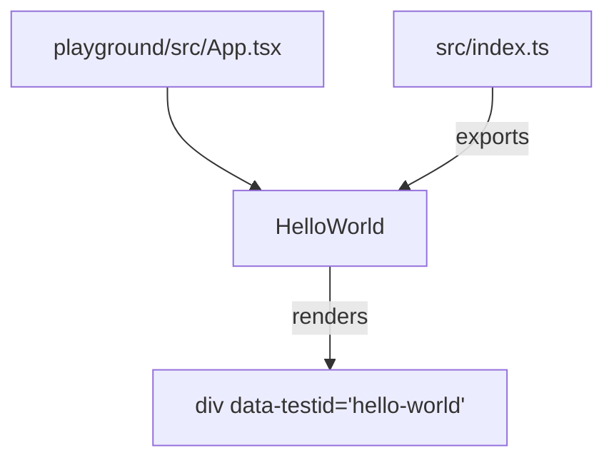
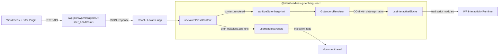
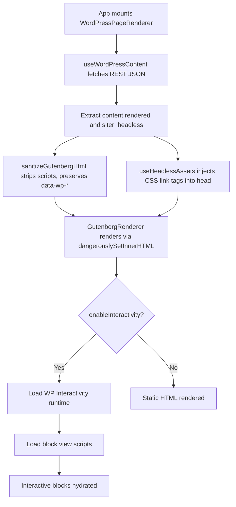

# Architecture

This document describes the system architecture for `@siter/headless-gutenberg-react`. It is the primary reference for understanding how the package fits into the WordPress-to-React data flow.

Primary audience: AI coding agents. Secondary audience: human developers.

## Current Phase

Phase 1. Only the project foundation exists. The sole runtime component is `HelloWorld`.

## Phase 1 Component Tree



## Long-Term System Architecture

The full system involves a WordPress site with the Siter plugin, a REST API boundary, and a React frontend consuming the data.



## Future Data Flow

When a React app renders a WordPress page, the following pipeline executes:



## Responsibility Separation

### WordPress plugin responsibilities

- Render Gutenberg blocks to HTML on the server
- Expose `content.rendered` via REST API
- Generate scoped CSS and expose via `siter_headless.css_urls`
- Expose wrapper class via `siter_headless.wrapper`
- Expose used block list via `siter_headless.blocks`
- Report asset generation status via `siter_headless.status`

### React package responsibilities

- Fetch REST API data (future)
- Sanitize HTML with DOMPurify preserving `data-wp-*` attributes (future)
- Render sanitized HTML safely via `dangerouslySetInnerHTML` (future)
- Inject CSS `<link>` tags and manage their lifecycle (future)
- Optionally load WordPress Interactivity API runtime and block scripts (future)
- Provide developer-friendly hooks and components

## Core Architecture Decision

**Do not convert Gutenberg blocks into custom React components.**

WordPress-rendered HTML is the source of truth. The React package consumes, sanitizes, and displays that HTML. It does not re-implement block rendering logic.

Rationale:
- WordPress already renders blocks correctly with full theme and plugin support.
- Re-implementing blocks in React would create a maintenance burden tracking WordPress core changes.
- The Siter plugin generates scoped CSS that matches the rendered HTML. Custom React components would break this coupling.
- The WordPress Interactivity API expects specific DOM structures with `data-wp-*` attributes. Those must be preserved verbatim.

## SSR Safety

All hooks and utilities that access `window` or `document` must guard against server-side rendering:

```typescript
if (typeof document === 'undefined') return;
```

This ensures the package works in Next.js, Remix, and other SSR frameworks without errors.

## Dependency Philosophy

- React and ReactDOM are peer dependencies, never bundled.
- Production dependencies are minimized. DOMPurify will be the only planned production dep (Phase 3).
- Dev dependencies cover build (tsup), test (vitest, playwright, RTL), and lint (eslint, prettier).
- New dependencies require justification per rule `003-security-rules.mdc`.

## Relevant Rules and Skills

| Concern | Rule / Skill |
|---------|-------------|
| Architecture decisions | `005-project-headless-gutenberg.mdc` |
| Security of HTML rendering | `security-review` skill, `003-security-rules.mdc` |
| React patterns | `004-react-typescript.mdc`, `react-best-practices.md` reference |
| Clean architecture principles | `external/ciembor/clean-architecture.mini.md` reference |
