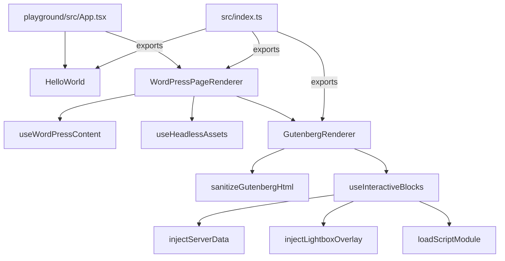
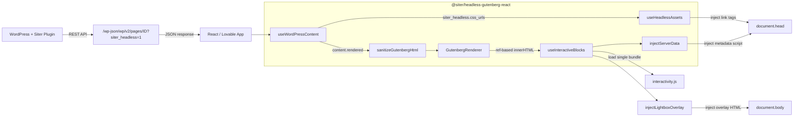
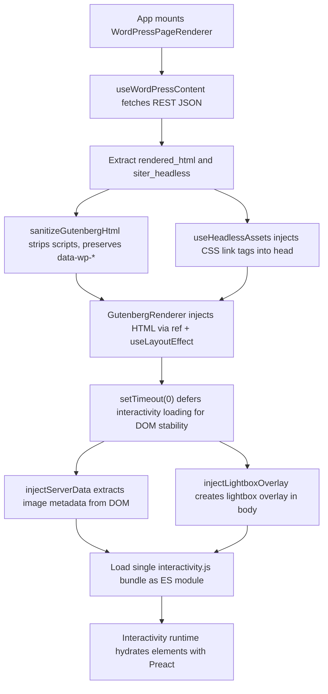
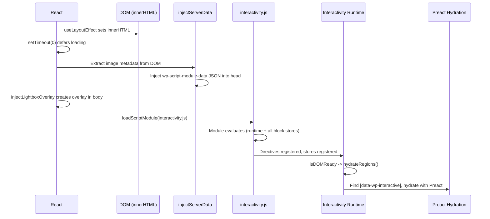

# Architecture

This document describes the system architecture for `@siter/headless-gutenberg-react`. It is the primary reference for understanding how the package fits into the WordPress-to-React data flow.

Primary audience: AI coding agents. Secondary audience: human developers.

## Current Phase

All phases (1--8) are implemented. The package is published on npm and includes content fetching, HTML sanitization, CSS injection, interactivity hydration, and a Vite playground with live WordPress testing.

## Component Tree



## System Architecture

The full system involves a WordPress site with the Siter plugin, a REST API boundary, and a React frontend consuming the data.



## Data Flow

When a React app renders a WordPress page, the following pipeline executes:



## HTML Rendering Strategy

`GutenbergRenderer` uses ref-based DOM injection instead of `dangerouslySetInnerHTML`. This is a deliberate architectural decision:

1. An outer `<div>` holds the `containerRef` (used by `useInteractiveBlocks` for DOM detection).
2. An inner `<div>` holds the `innerRef` where HTML is injected via `useLayoutEffect` + `innerHTML`.
3. A `renderedHtmlRef` tracks the last injected HTML to avoid redundant DOM mutations.

This approach prevents React's virtual DOM reconciliation from interfering with the WordPress Interactivity API's Preact-based hydration. If `dangerouslySetInnerHTML` were used, React StrictMode's double-mount cycle would destroy and recreate the DOM, causing the interactivity runtime to encounter detached elements.

## Interactivity Loading Architecture

All interactivity scripts are bundled into a **single `interactivity.js` file** at build time using esbuild. This file contains:

- The `@wordpress/interactivity` runtime (Preact-based directive processor)
- Block view scripts from `@wordpress/block-library` (accordion, image, tabs, file)

The single-bundle approach eliminates several problems:

1. **No import maps needed** -- all dependencies are resolved at build time.
2. **No loading order bugs** -- the runtime and block stores are guaranteed to be in the same module evaluation.
3. **No CORS issues** -- everything is served locally from `dist/interactivity/`.
4. **Static site compatible** -- no remote script loading at runtime.

### Build process

`scripts/build-interactivity.mjs` generates a temporary entry file that imports all block view scripts, then esbuild bundles them (with `ignoreAnnotations: true` to prevent tree-shaking of side-effectful store registrations) into a single minified ES module.

### Loading sequence



### Server data injection

The WordPress Interactivity API expects a `<script type="application/json" id="wp-script-module-data-@wordpress/interactivity">` tag containing initial state. In a normal WordPress page load, this is rendered server-side. In the headless context, `injectServerData` extracts image metadata from the rendered HTML's `data-wp-context` attributes and injects the equivalent JSON tag.

### Lightbox overlay injection

WordPress's image block PHP renderer outputs a singleton `<div class="wp-lightbox-overlay">` in `wp_footer`. This overlay is never included in `content.rendered` or `rendered_html`. The `injectLightboxOverlay` function creates this overlay element and appends it to `document.body` before the interactivity runtime hydrates, so the lightbox can function correctly in the headless context.

### Build output

```
dist/interactivity/
  interactivity.js    # Single bundle: runtime + all block view scripts
```

### Supported interactive blocks

| Block | Interactivity | Status |
|-------|--------------|--------|
| `core/accordion` | Expand/collapse | Working |
| `core/image` | Lightbox overlay | Working (overlay injected client-side) |
| `core/gallery` | Multi-image lightbox with navigation | Working |
| `core/tabs` | Tab switching | Bundled |
| `core/file` | File download | Bundled |

## Responsibility Separation

### WordPress plugin responsibilities

- Render Gutenberg blocks to HTML on the server
- Expose `content.rendered` via REST API
- Expose full rendered HTML via `siter_headless.rendered_html`
- Generate scoped CSS and expose via `siter_headless.css_urls`
- Expose wrapper class via `siter_headless.wrapper`
- Expose used block list via `siter_headless.blocks`
- Report asset generation status via `siter_headless.status`

### React package responsibilities

- Fetch REST API data via `useWordPressContent`
- Sanitize HTML with DOMPurify preserving `data-wp-*` attributes
- Render HTML safely via ref-based `innerHTML` injection (outside React reconciliation)
- Inject CSS `<link>` tags and manage their lifecycle
- Extract and inject image metadata for lightbox support (`injectServerData`)
- Inject lightbox overlay HTML that WordPress renders server-side (`injectLightboxOverlay`)
- Apply configurable layout CSS custom properties (`contentSize`, `wideSize`)
- Load single locally bundled interactivity module
- Provide developer-friendly hooks and components

## Core Architecture Decision

**Do not convert Gutenberg blocks into custom React components.**

WordPress-rendered HTML is the source of truth. The React package consumes, sanitizes, and displays that HTML. It does not re-implement block rendering logic.

Rationale:
- WordPress already renders blocks correctly with full theme and plugin support.
- Re-implementing blocks in React would create a maintenance burden tracking WordPress core changes.
- The Siter plugin generates scoped CSS that matches the rendered HTML. Custom React components would break this coupling.
- The WordPress Interactivity API expects specific DOM structures with `data-wp-*` attributes. Those must be preserved verbatim.

## SSR Safety

All hooks and utilities that access `window` or `document` must guard against server-side rendering:

```typescript
if (typeof document === 'undefined') return;
```

This ensures the package works in Next.js, Remix, and other SSR frameworks without errors.

## Dependency Philosophy

- React and ReactDOM are peer dependencies, never bundled.
- Production dependencies: `dompurify` (sanitization), `@wordpress/interactivity` (runtime), `@wordpress/block-library` (block view scripts).
- Interactivity dependencies are bundled at build time into a single `dist/interactivity/interactivity.js` and do not add to the consumer's bundle size.
- Dev dependencies cover build (tsup, esbuild), test (vitest, playwright, RTL), and lint (eslint, prettier).
- New dependencies require justification per rule `003-security-rules.mdc`.

## Relevant Rules and Skills

| Concern | Rule / Skill |
|---------|-------------|
| Architecture decisions | `005-project-headless-gutenberg.mdc` |
| Security of HTML rendering | `security-review` skill, `003-security-rules.mdc` |
| React patterns | `004-react-typescript.mdc`, `react-best-practices.md` reference |
| Clean architecture principles | `external/ciembor/clean-architecture.mini.md` reference |
