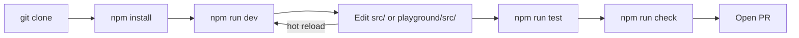
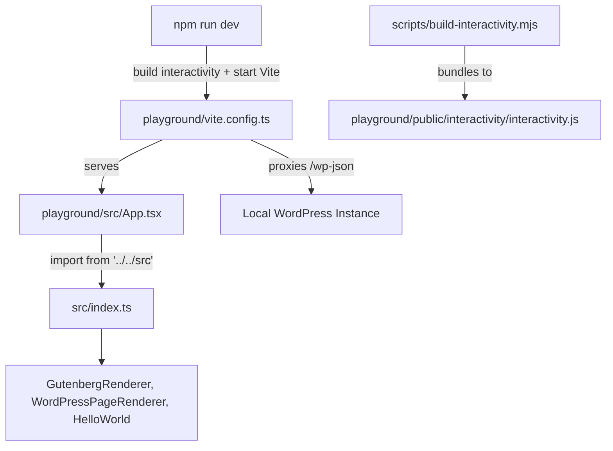

# Local Development

Comprehensive guide for setting up and working with the project locally.

Primary audience: AI coding agents. Secondary audience: human developers.

For a minimal command-only reference, see [quickstart.md](quickstart.md).

## Development Workflow



## First-Time Setup

### Prerequisites

- Node.js 22 or later
- npm (not pnpm or yarn)
- Git
- (Optional) Local WordPress instance with Siter plugin for live testing

### Clone and install

```bash
git clone <repo-url>
cd wp-gutenberg-content-renderer
npm install
```

### Install Playwright browsers (first time only)

```bash
npm run prepare:e2e
```

This downloads the Chromium browser binary used by Playwright. It only needs to run once per machine.

## Running the Playground

```bash
npm run dev
```

Opens the Vite development server at `http://127.0.0.1:5173`.

The `dev` command first builds the interactivity bundle to `playground/public/interactivity/`, then starts the Vite dev server. This ensures the interactivity script is available locally.

### Playground Architecture

The playground is a separate Vite app in `playground/` that imports the library source directly:



Key points:
- The playground imports directly from `../../src`, not from a built `dist/` package.
- Changes to library source files hot-reload in the playground immediately.
- The playground has its own `package.json` with its own dependencies (react, react-dom, vite).
- The playground's `tsconfig.json` extends the root `tsconfig.json`.
- The Vite config proxies `/wp-json` requests to the local WordPress instance for CORS-free REST API access.
- The interactivity bundle is pre-built to `playground/public/interactivity/interactivity.js` and served as a static file.

### WordPress Integration Testing

The playground supports testing against a local WordPress instance:

1. Enter the WordPress Base URL (leave empty to use the proxy, which defaults to `https://lovable-wp-integration.local`).
2. Enter the Post ID (defaults to `1`).
3. Click "Load Post" to fetch and render the content.

The rendered content includes:
- CSS stylesheet injection from `siter_headless.css_urls`
- HTML sanitization with DOMPurify
- Interactive block hydration (accordion expand/collapse)

### What to edit

| Area | Directory | Purpose |
|------|-----------|---------|
| Library source | `src/` | Components, hooks, types that ship in the npm package |
| Playground UI | `playground/src/` | Local demo app for manual testing |
| Unit tests | `src/**/__tests__/` | Vitest + React Testing Library tests |
| Browser tests | `e2e/` | Playwright tests against the playground |
| Build scripts | `scripts/` | esbuild script for interactivity bundle |

## Available Scripts

| Script | Description |
|--------|-------------|
| `npm run dev` | Build interactivity bundle and start playground dev server |
| `npm run build` | Build library to `dist/` (ESM, CJS, .d.ts) and interactivity bundle |
| `npm run build:interactivity` | Build interactivity bundle to `dist/interactivity/` |
| `npm run build:interactivity:playground` | Build interactivity bundle to `playground/public/interactivity/` |
| `npm run typecheck` | Run TypeScript compiler check |
| `npm run test` | Run unit tests once |
| `npm run test:watch` | Run unit tests in watch mode |
| `npm run test:e2e` | Run Playwright tests (auto-starts playground) |
| `npm run test:e2e:ui` | Run Playwright with interactive UI |
| `npm run lint` | Run ESLint |
| `npm run format` | Auto-format with Prettier |
| `npm run check` | Run typecheck + lint + test + build in sequence |
| `npm run prepare:e2e` | Install Playwright browser binaries |

## Build Output

`npm run build` uses tsup to produce the library bundle and esbuild to produce the interactivity bundle:

```
dist/
  index.js             # ESM module
  index.cjs            # CommonJS module
  index.d.ts           # TypeScript declarations
  index.js.map         # Source map
  interactivity/
    interactivity.js   # Single bundle: runtime + all block view scripts
```

React and ReactDOM are externalized (not bundled).

The `dist/interactivity/` directory is included in the published npm package so consumers get the interactivity bundle without needing to run the build script themselves.

## Local WordPress Testing

### Expected local setup

A local WordPress instance (e.g., via Docker, Local, or DevKinsta) with the Siter plugin installed.

### Expected endpoint

```
https://lovable-wp-integration.local/wp-json/wp/v2/posts/{id}?siter_headless=1
```

### Playground configuration

The playground supports:
- WordPress base URL (text input, leave empty for proxy)
- Post ID (number input, defaults to 1)

The Vite proxy in `playground/vite.config.ts` forwards `/wp-json` requests to `https://lovable-wp-integration.local` with `secure: false` for self-signed certificates.

## Troubleshooting

### `npm install` fails

- Ensure Node.js 22+ is installed: `node --version`
- Delete `node_modules` and `package-lock.json`, then retry: `rm -rf node_modules package-lock.json && npm install`

### Playground does not start

- Ensure playground dependencies are installed: `cd playground && npm install && cd ..`
- Check that port 5173 is not already in use

### Interactivity not working

- Ensure the interactivity bundle is built: check that `playground/public/interactivity/interactivity.js` exists
- Rebuild with: `npm run build:interactivity:playground`
- Check the browser console for script loading errors
- Verify a `<script type="module" src="...interactivity.js">` tag appears in the page
- Verify the `wp-script-module-data-@wordpress/interactivity` JSON script tag is injected in `<head>`
- Accordion: check that `aria-expanded` toggles on heading button click
- Gallery lightbox: requires server-rendered `<div class="wp-lightbox-overlay">` in the HTML (see known limitations in architecture.md)

### Playwright tests fail to start

- Run `npm run prepare:e2e` to install browser binaries
- On CI, use `npx playwright install --with-deps chromium` to include system dependencies

### TypeScript errors in playground

- The playground `tsconfig.json` extends the root. If new source directories are added, update the root `tsconfig.json` `include` array.

### ESLint reports errors in generated files

- The ESLint config ignores `dist/`, `coverage/`, `playground/dist/`, `playground/public/interactivity/`, `scripts/`, `playwright-report/`, and `test-results/`. If new generated directories appear, add them to the ignores in `eslint.config.js`.
