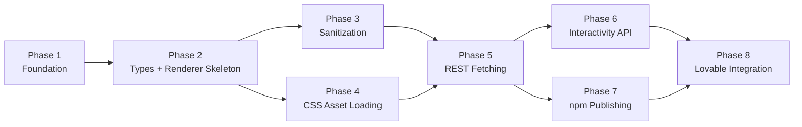

# Roadmap

Development roadmap for `@siter/headless-gutenberg-react`.

Primary audience: AI coding agents. Secondary audience: human developers.

## Phase Dependencies

## Phase 1: Foundation

**Status:** Complete

**Deliverables:**
- Project scaffold (package.json, tsconfig, tsup, vitest, playwright, eslint, prettier)
- AGENTS.md and Cursor rules
- Documentation (architecture, local dev, testing, WordPress plan, roadmap, quickstart)
- HelloWorld component
- Unit tests (Vitest + React Testing Library)
- Playwright browser test
- Vite playground
- GitHub Actions CI

## Phase 2: Types and Renderer Skeleton

**Status:** Complete

**Deliverables:**
- `src/types/wordpress.ts` with `SiterHeadlessAssets`, `WordPressRenderedContent`
- `GutenbergRendererProps`, `WordPressPageRendererProps` types
- `src/components/GutenbergRenderer.tsx` with wrapper/siteBlocks DOM structure
- `src/lib/normalizeWrapper.ts` (parse wrapper class from `assets.wrapper`)

## Phase 3: Sanitization

**Status:** Complete

**Deliverables:**
- `src/lib/sanitize.ts` with DOMPurify configuration
- Preserves `data-wp-*` attributes via `addHook('uponSanitizeAttribute')`
- Strips `<script>` tags and inline event handlers
- SSR guard (skip sanitization when `typeof window === 'undefined'`)
- Preserves `inert` attribute for accordion panels

## Phase 4: CSS Asset Loading

**Status:** Complete

**Deliverables:**
- `src/hooks/useHeadlessAssets.ts`
- Injects `<link rel="stylesheet">` tags with `data-siter-headless-css` attribute
- Deduplicates by href
- Tracks load/error events
- Cleanup on unmount
- SSR guard

## Phase 5: WordPress REST Fetching

**Status:** Complete

**Deliverables:**
- `src/hooks/useWordPressContent.ts`
- Fetch by ID or slug with AbortController cleanup
- `src/components/WordPressPageRenderer.tsx` convenience component
- Configurable `htmlField` (`rendered_html` with fallback to `content.rendered`)
- Loading and error states

## Phase 6: WordPress Interactivity API

**Status:** Complete

**Deliverables:**
- `src/lib/wp-interactive-blocks.ts` (supported blocks set, bundle path builder)
- `src/lib/loadScriptModule.ts` (dynamic ES module loader)
- `src/lib/injectServerData.ts` (extracts image metadata from DOM, injects as JSON script tag)
- `src/hooks/useInteractiveBlocks.ts` (orchestrates loading with deferred execution)
- `scripts/build-interactivity.mjs` (esbuild bundler for single interactivity bundle)
- Single `interactivity.js` bundle containing runtime + all block view scripts
- Ref-based HTML injection (`useLayoutEffect` + `innerHTML`) for DOM stability
- `setTimeout(0)` deferral to prevent React StrictMode race conditions
- Supported blocks: accordion, image/gallery, tabs, file
- Known limitation: gallery lightbox requires server-rendered overlay HTML

## Phase 7: npm Publishing

**Status:** Complete

**Deliverables:**
- `.github/workflows/publish.yml` with npm trusted publishing (OIDC)
- Provenance support via `--provenance`
- `.github/workflows/ci.yml` for continuous integration

## Phase 8: Lovable Integration Examples

**Status:** Complete

**Deliverables:**
- Lovable usage guide in README
- Local WordPress testing via playground
- Vite proxy for REST API during development

## Skills and Rules Relevance by Phase

| Phase | Key rules | Key skills |
|-------|-----------|------------|
| 1 | 001, 002, 004, 005 | `coding-guidelines` |
| 2 | 004, 005 | `coding-guidelines` |
| 3 | 003, 004, 005 | `security-review`, `coding-guidelines` |
| 4 | 004, 005 | `coding-guidelines` |
| 5 | 004, 005 | `coding-guidelines` |
| 6 | 003, 004, 005 | `security-review`, `coding-guidelines` |
| 7 | 003 | `security-review` |
| 8 | 004, 005 | `coding-guidelines` |
