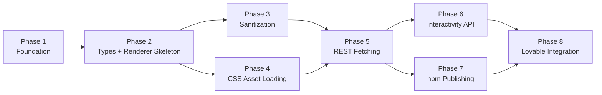

# Roadmap

Development roadmap for `@siter/headless-gutenberg-react`.

Primary audience: AI coding agents. Secondary audience: human developers.

## Phase Dependencies

## Phase 1: Foundation (current)

**Status:** In progress

**Deliverables:**
- Project scaffold (package.json, tsconfig, tsup, vitest, playwright, eslint, prettier)
- AGENTS.md and Cursor rules
- Documentation (architecture, local dev, testing, WordPress plan, roadmap, quickstart)
- HelloWorld component
- Unit tests (Vitest + React Testing Library)
- Playwright browser test
- Vite playground
- GitHub Actions CI

**Files created:**
- `src/components/HelloWorld.tsx`
- `src/index.ts`
- `src/components/__tests__/HelloWorld.test.tsx`
- `e2e/hello-world.spec.ts`
- `playground/` (full Vite app)

**Exports:** `HelloWorld`, `HelloWorldProps`

**Acceptance criteria:**
- `npm run check` passes (typecheck + lint + test + build)
- `npm run test:e2e` passes
- Playground renders at `http://127.0.0.1:5173`

## Phase 2: Types and Renderer Skeleton

**Deliverables:**
- `src/types/wordpress.ts` with `SiterHeadlessAssets`, `WordPressRenderedContent`
- `GutenbergRendererProps`, `WordPressPageRendererProps` types
- `src/components/GutenbergRenderer.tsx` skeleton (accepts html prop, renders unsanitized for now)
- `src/lib/normalizeWrapper.ts` (parse wrapper class from `assets.wrapper`)

**New exports:** `GutenbergRenderer`, `GutenbergRendererProps`, `SiterHeadlessAssets`, `WordPressRenderedContent`

**Tests:** Unit tests for normalizeWrapper, GutenbergRenderer basic rendering

**Relevant rules:** `004-react-typescript.mdc`, `005-project-headless-gutenberg.mdc`

## Phase 3: Sanitization

**Deliverables:**
- `src/lib/sanitize.ts` with DOMPurify configuration
- Preserve `data-wp-*` attributes via `addHook('uponSanitizeAttribute')`
- Strip `<script>` tags and inline event handlers
- SSR guard (skip sanitization when `typeof window === 'undefined'`)

**New exports:** `sanitizeGutenbergHtml`

**New dependency:** `dompurify`

**Tests:**
- Preserves data-wp-interactive, data-wp-context, data-wp-on--click, etc.
- Strips script tags and onclick handlers
- Preserves iframes, srcset, loading, decoding attributes

**Relevant skills:** `security-review` (must be invoked for this phase)

## Phase 4: CSS Asset Loading

**Deliverables:**
- `src/hooks/useHeadlessAssets.ts`
- Inject `<link rel="stylesheet">` tags with `data-siter-headless-css` attribute
- Deduplicate by href
- Track load/error events
- Cleanup on unmount
- SSR guard

**New exports:** `useHeadlessAssets`

**Tests:**
- Links injected into document.head
- Duplicates prevented
- Cleanup removes links
- Load/error state tracking

## Phase 5: WordPress REST Fetching

**Deliverables:**
- `src/hooks/useWordPressContent.ts`
- Fetch by ID or slug
- AbortController for cleanup
- `src/components/WordPressPageRenderer.tsx` convenience component
- Loading and error states

**New exports:** `useWordPressContent`, `WordPressPageRenderer`, `WordPressPageRendererProps`

**Tests:**
- Fetch by ID
- Fetch by slug (array response handling)
- Abort on unmount
- Error exposure
- WordPressPageRenderer integration

**Playground update:** Add configurable WordPress URL input

## Phase 6: WordPress Interactivity API

**Deliverables:**
- `src/lib/wp-interactive-blocks.ts` (block-to-script map)
- `src/lib/loadScriptModule.ts` (dynamic script module loader)
- `src/hooks/useInteractiveBlocks.ts`
- Load interactivity runtime, router, and block scripts
- Global deduplication cache

**New exports:** `useInteractiveBlocks`

**Tests:**
- Script loading order (runtime -> router -> blocks)
- Deduplication
- DOM detection fallback for `[data-wp-interactive]`
- SSR guard

**Relevant skills:** `security-review` (script loading from external origins)

## Phase 7: npm Publishing

**Deliverables:**
- `.github/workflows/publish.yml`
- npm trusted publishing via GitHub Actions OIDC (no long-lived tokens)
- Provenance support
- Release process documentation

**CI requirements:**
- Triggered on GitHub release creation
- Uses `permissions: id-token: write` for OIDC
- Runs `npm publish --provenance`

**Relevant skills:** `security-review` (publishing security)

## Phase 8: Lovable Integration Examples

**Deliverables:**
- Lovable usage guide in docs
- Demo app examples
- Local WordPress testing examples
- Integration patterns for AI-generated React apps

## Skills and Rules Relevance by Phase

| Phase | Key rules | Key skills |
|-------|-----------|------------|
| 1 | 001, 002, 004, 005 | `coding-guidelines` |
| 2 | 004, 005 | `coding-guidelines` |
| 3 | 003, 004, 005 | `security-review`, `coding-guidelines` |
| 4 | 004, 005 | `coding-guidelines` |
| 5 | 004, 005 | `coding-guidelines` |
| 6 | 003, 004, 005 | `security-review`, `coding-guidelines` |
| 7 | 003 | `security-review` |
| 8 | 004, 005 | `coding-guidelines` |
