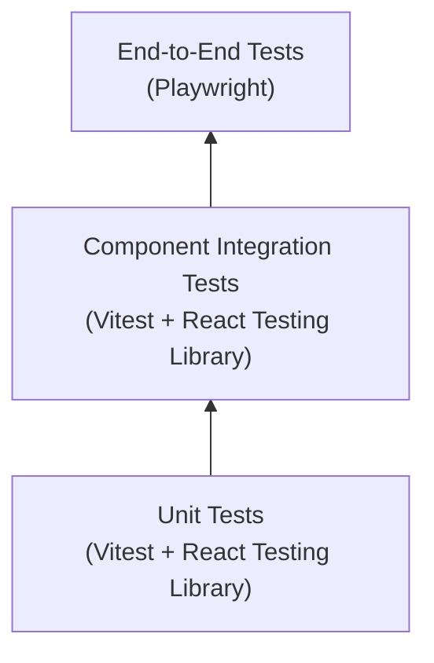
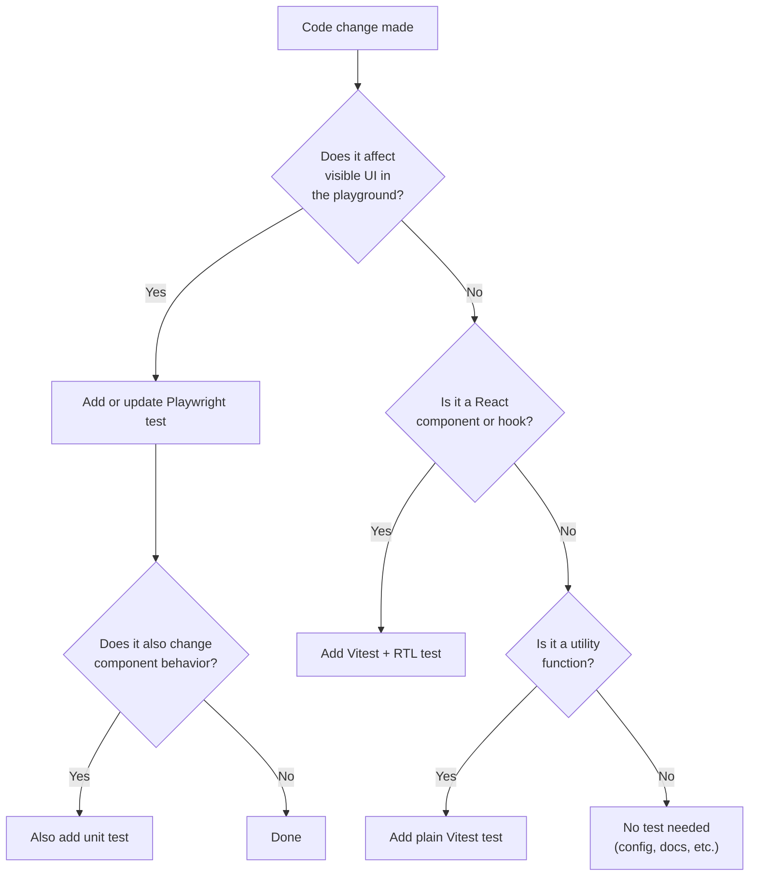

# Testing Strategy

Comprehensive guide for understanding and extending the test suite.

Primary audience: AI coding agents. Secondary audience: human developers.

## Testing Pyramid



| Layer | Tool | Speed | What it tests |
|-------|------|-------|---------------|
| Unit | Vitest + RTL | Fast (ms) | Individual component output, props, hooks |
| Integration | Vitest + RTL | Fast (ms) | Component composition, DOM behavior |
| E2E | Playwright | Slower (seconds) | Full browser rendering, playground behavior |

## Test Decision Tree

Use this to decide which type of test to write for a change:



## Unit Testing with Vitest

### Configuration

Defined in `vitest.config.ts`:
- Environment: `jsdom` (simulates browser DOM)
- Setup file: `src/test/setup.ts` (loads `@testing-library/jest-dom` matchers)
- Globals: `true` (no need to import `describe`, `it`, `expect` in test files)

### File location

Tests live next to the code they test, in `__tests__/` directories:

```
src/
├── components/
│   ├── HelloWorld.tsx
│   └── __tests__/
│       └── HelloWorld.test.tsx
├── hooks/              # future
│   ├── useHeadlessAssets.ts
│   └── __tests__/
│       └── useHeadlessAssets.test.ts
└── lib/                # future
    ├── sanitize.ts
    └── __tests__/
        └── sanitize.test.ts
```

### Commands

```bash
npm run test          # run once
npm run test:watch    # watch mode (re-runs on file changes)
```

### Writing tests

Use React Testing Library to test component behavior, not implementation details:

```typescript
import { render, screen } from '@testing-library/react';
import { describe, expect, it } from 'vitest';
import { HelloWorld } from '../HelloWorld';

describe('HelloWorld', () => {
  it('renders the default greeting', () => {
    render(<HelloWorld />);
    expect(screen.getByTestId('hello-world')).toHaveTextContent('Hello World');
  });
});
```

Key principles:
- Test what the user sees, not internal state.
- Use `getByTestId`, `getByRole`, `getByText` to find elements.
- Use `toHaveTextContent`, `toBeVisible`, `toBeInTheDocument` for assertions.
- Avoid testing implementation details like state values or internal method calls.

## Browser Testing with Playwright

### Configuration

Defined in `playwright.config.ts`:
- Test directory: `e2e/`
- Base URL: `http://127.0.0.1:5173`
- Web server: auto-starts `npm run dev` before tests
- Browser: Chromium only (expand in CI as needed)
- Retries: 2 on CI, 0 locally

### Commands

```bash
npm run test:e2e      # run tests headlessly
npm run test:e2e:ui   # run with Playwright's interactive UI
npm run prepare:e2e   # install browser binaries (first time)
```

### Web-first assertions

Playwright assertions automatically wait and retry. Always prefer these over manual checks:

```typescript
// Correct: web-first assertion (auto-waits)
await expect(page.getByTestId('hello-world')).toHaveText('Hello Siter');
await expect(page.getByRole('heading', { name: 'Title' })).toBeVisible();

// Incorrect: manual check (does not wait, flaky)
const text = await page.getByTestId('hello-world').textContent();
expect(text).toBe('Hello Siter');
```

### When to add Playwright tests

- A new component is rendered in the playground
- Playground layout or navigation changes
- Future: WordPress REST integration is testable in browser
- Future: CSS asset injection is visible in browser
- Future: interactive blocks hydrate in browser

## Future Test Categories

### Phase 3: Sanitization tests (Vitest)

- DOMPurify preserves `data-wp-*` attributes
- Script tags are stripped
- Inline event handlers are stripped
- Iframes with safe attributes are preserved
- SSR guard returns raw HTML when `document` is unavailable

### Phase 4: CSS asset loading tests (Vitest)

- `useHeadlessAssets` injects `<link>` tags into `document.head`
- Duplicate CSS URLs are not injected twice
- Cleanup removes injected links on unmount
- SSR guard skips DOM manipulation

### Phase 5: REST fetching tests (Vitest)

- `useWordPressContent` fetches by ID
- `useWordPressContent` fetches by slug (array response, takes first)
- AbortController cancels on unmount
- Error states are exposed

### Phase 6: Interactivity tests (Vitest + Playwright)

- Block script modules load once (no duplicates)
- Interactivity runtime loads before block scripts
- Router module loads when `core/query` is present
- DOM detection fallback scans for `[data-wp-interactive]`

## Coverage Expectations

Phase 1 does not enforce coverage thresholds. As the codebase grows:

- Public API functions and components: 100% coverage target
- Internal utilities: 80%+ coverage target
- Playground code: no coverage requirement (tested via Playwright)

## Relevant Rules and Skills

| Concern | Reference |
|---------|-----------|
| Goal-driven test execution | `coding-guidelines` skill, section 4 |
| Test quality | `clean-code-review` skill, `external/ciembor/clean-code.mini.md` |
| Testing React components | `004-react-typescript.mdc` |
| Security testing for HTML | `security-review` skill |
