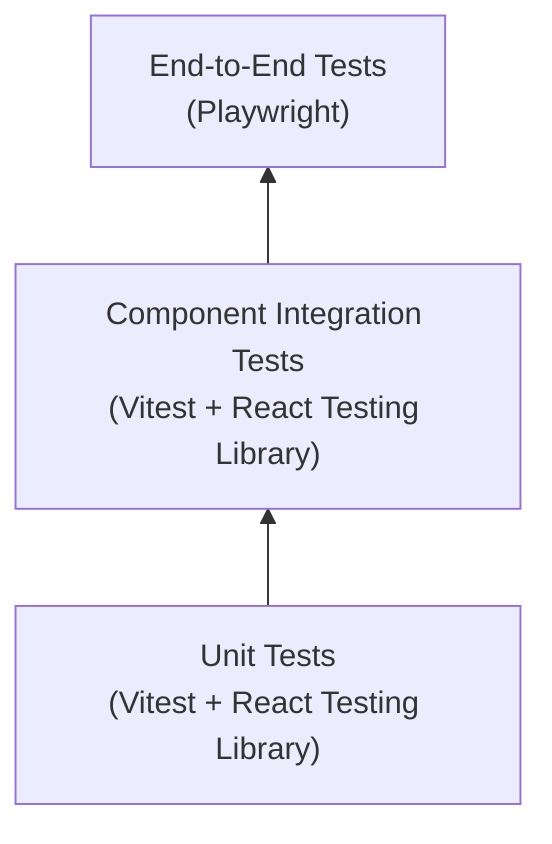
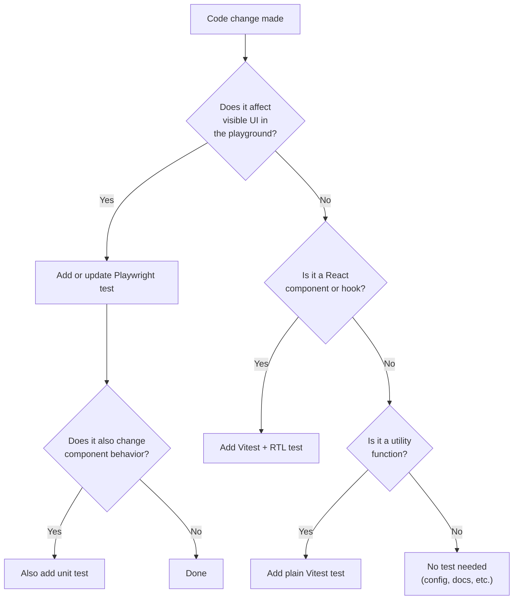

# Testing Strategy

Comprehensive guide for understanding and extending the test suite.

Primary audience: AI coding agents. Secondary audience: human developers.

## Testing Pyramid



| Layer | Tool | Speed | What it tests |
|-------|------|-------|---------------|
| Unit | Vitest + RTL | Fast (ms) | Individual component output, props, hooks |
| Integration | Vitest + RTL | Fast (ms) | Component composition, DOM behavior |
| E2E | Playwright | Slower (seconds) | Full browser rendering, playground behavior, interactivity |

## Test Decision Tree

Use this to decide which type of test to write for a change:



## Unit Testing with Vitest

### Configuration

Defined in `vitest.config.ts`:
- Environment: `jsdom` (simulates browser DOM)
- Setup file: `src/test/setup.ts` (loads `@testing-library/jest-dom` matchers)
- Globals: `true` (no need to import `describe`, `it`, `expect` in test files)

### File location

Tests live next to the code they test, in `__tests__/` directories:

```
src/
  components/
    GutenbergRenderer.tsx
    WordPressPageRenderer.tsx
    HelloWorld.tsx
    __tests__/
      GutenbergRenderer.test.tsx
      WordPressPageRenderer.test.tsx
      HelloWorld.test.tsx
  hooks/
    useWordPressContent.ts
    useHeadlessAssets.ts
    useInteractiveBlocks.ts
    __tests__/
      useWordPressContent.test.ts
      useHeadlessAssets.test.ts
      useInteractiveBlocks.test.ts
  lib/
    sanitize.ts
    normalizeWrapper.ts
    loadScriptModule.ts
    injectServerData.ts
    wp-interactive-blocks.ts
    __tests__/
      sanitize.test.ts
      normalizeWrapper.test.ts
      loadScriptModule.test.ts
      injectServerData.test.ts
      wp-interactive-blocks.test.ts
```

### Commands

```bash
npm run test          # run once
npm run test:watch    # watch mode (re-runs on file changes)
```

### Writing tests

Use React Testing Library to test component behavior, not implementation details:

```typescript
import { render, screen } from '@testing-library/react';
import { describe, expect, it } from 'vitest';
import { HelloWorld } from '../HelloWorld';

describe('HelloWorld', () => {
  it('renders the default greeting', () => {
    render(<HelloWorld />);
    expect(screen.getByTestId('hello-world')).toHaveTextContent('Hello World');
  });
});
```

Key principles:
- Test what the user sees, not internal state.
- Use `getByTestId`, `getByRole`, `getByText` to find elements.
- Use `toHaveTextContent`, `toBeVisible`, `toBeInTheDocument` for assertions.
- Avoid testing implementation details like state values or internal method calls.

### Testing deferred effects

`useInteractiveBlocks` uses `setTimeout(0)` to defer script loading. Tests must use `vi.useFakeTimers()` and `vi.advanceTimersByTime()` to trigger the deferred callback:

```typescript
vi.useFakeTimers();
renderHook(() => useInteractiveBlocks({ ... }));
await act(async () => { vi.advanceTimersByTime(10); });
// Now assert on injected script tags
```

## Browser Testing with Playwright

### Configuration

Defined in `playwright.config.ts`:
- Test directory: `e2e/`
- Base URL: `http://127.0.0.1:5173`
- Web server: auto-starts `npm run dev` before tests
- Browser: Chromium only (expand in CI as needed)
- Retries: 2 on CI, 0 locally

### Commands

```bash
npm run test:e2e      # run tests headlessly
npm run test:e2e:ui   # run with Playwright's interactive UI
npm run prepare:e2e   # install browser binaries (first time)
```

### Web-first assertions

Playwright assertions automatically wait and retry. Always prefer these over manual checks:

```typescript
// Correct: web-first assertion (auto-waits)
await expect(page.getByTestId('hello-world')).toHaveText('Hello Siter');
await expect(page.getByRole('heading', { name: 'Title' })).toBeVisible();

// Incorrect: manual check (does not wait, flaky)
const text = await page.getByTestId('hello-world').textContent();
expect(text).toBe('Hello Siter');
```

### When to add Playwright tests

- A new component is rendered in the playground
- Playground layout or navigation changes
- WordPress REST integration is testable in browser
- CSS asset injection is visible in browser
- Interactive blocks hydrate in browser (accordion, lightbox)

### Interactivity hydration testing

E2E tests for interactivity use a `waitForInteractivityHydration` helper that waits for Preact's event listener attachment (detected via the `l` property on hydrated elements):

```typescript
async function waitForInteractivityHydration(page: Page) {
  await page.waitForFunction(
    () => {
      const btn = document.querySelector('.wp-block-accordion-heading button');
      return btn && 'l' in btn;
    },
    { timeout: 15_000 }
  );
}
```

## Current Test Coverage

### Sanitization tests (Vitest)

- DOMPurify preserves `data-wp-*` attributes (interactive, context, on--click, bind, class, watch, init)
- Script tags are stripped
- Inline event handlers are stripped (onclick, onerror)
- Iframes with safe attributes are preserved
- srcset, sizes, loading, decoding, target, rel attributes preserved
- Complex Gutenberg HTML with multiple data-wp-* attributes handled

### CSS asset loading tests (Vitest)

- `useHeadlessAssets` injects `<link>` tags into `document.head`
- Duplicate CSS URLs are not injected twice
- Cleanup removes injected links on unmount
- Loading and error state tracking

### REST fetching tests (Vitest)

- `useWordPressContent` fetches by ID
- `useWordPressContent` fetches by slug (array response, takes first)
- Custom postType support
- AbortController cancels on unmount
- Error states are exposed
- Empty slug array response handling

### Interactivity tests (Vitest + Playwright)

- Single interactivity bundle loads for interactive blocks (Vitest)
- Same bundle loads regardless of which blocks are present (Vitest)
- Unsupported blocks are filtered out (Vitest)
- No bundle loads when only unsupported blocks present (Vitest)
- Accordion expands/collapses on click (Playwright)
- Interactivity bundle, server data, and Preact hydration verified (Playwright)

### Server data injection tests (Vitest)

- Image metadata extracted from `data-wp-context` attributes
- Gallery parent context linked to child images
- JSON script tag injected into document head
- Idempotent injection (only injects once)
- Reset function cleans up injected tag

### Component tests (Vitest)

- GutenbergRenderer renders HTML with wrapper class, siteBlocksClass
- WordPressPageRenderer resolves rendered_html with fallback
- Props forwarding (wrapperClass, siteBlocksClass, htmlField)
- Title display toggle

## Coverage Expectations

- Public API functions and components: 100% coverage target
- Internal utilities: 80%+ coverage target
- Playground code: no coverage requirement (tested via Playwright)

## Relevant Rules and Skills

| Concern | Reference |
|---------|-----------|
| Goal-driven test execution | `coding-guidelines` skill, section 4 |
| Test quality | `clean-code-review` skill, `external/ciembor/clean-code.mini.md` |
| Testing React components | `004-react-typescript.mdc` |
| Security testing for HTML | `security-review` skill |
