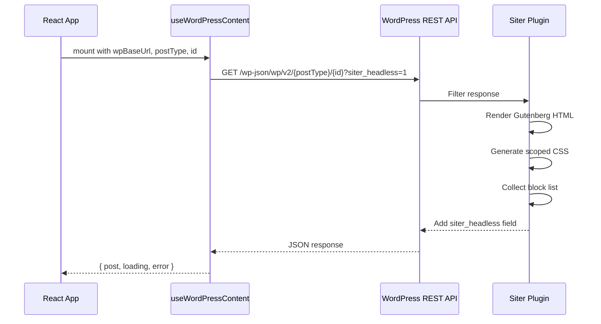
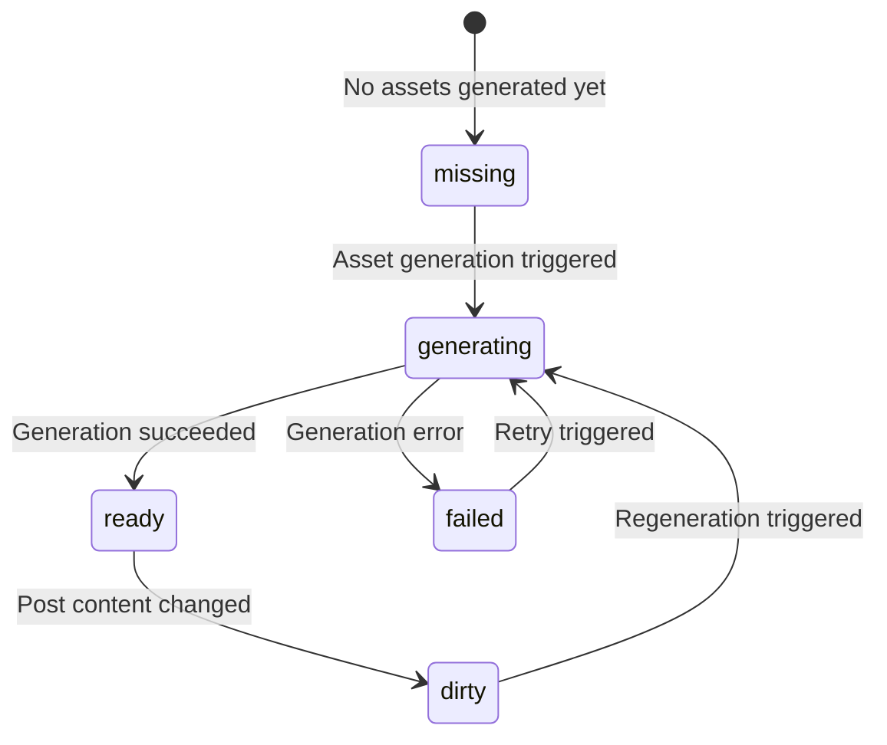

# WordPress Integration Plan

This document describes the future WordPress REST API integration. None of this is implemented in Phase 1.

Primary audience: AI coding agents. Secondary audience: human developers.

## Overview

The package will consume WordPress REST API responses enhanced by the Siter plugin, which adds a `siter_headless` field to post/page responses.

## REST API Request Flow



## Expected Request

```
GET /wp-json/wp/v2/pages/{id}?siter_headless=1
```

Or by slug:

```
GET /wp-json/wp/v2/pages?slug={slug}&siter_headless=1
```

Slug queries return an array; the hook will take the first element.

## Response TypeScript Interfaces

These types will be created in `src/types/wordpress.ts` in Phase 2.

```typescript
interface SiterHeadlessAssets {
  wrapper: string;
  status: 'ready' | 'dirty' | 'generating' | 'failed' | 'missing';
  is_stale: boolean;
  css_urls: string[];
  blocks: string[];
}

interface WordPressRenderedContent {
  id: number;
  title: { rendered: string };
  content: { rendered: string };
  excerpt: { rendered: string };
  siter_headless: SiterHeadlessAssets;
}
```

## Example JSON Response

```json
{
  "id": 42,
  "title": { "rendered": "My Page Title" },
  "content": {
    "rendered": "<div class=\"wp-gutenberg-content\"><p>Hello world</p><div data-wp-interactive=\"core/accordion\" data-wp-context='{\"isOpen\":false}'><button data-wp-on--click=\"actions.toggle\">Toggle</button><div data-wp-class--is-open=\"context.isOpen\">Content</div></div></div>"
  },
  "excerpt": { "rendered": "<p>Hello world</p>" },
  "siter_headless": {
    "wrapper": ".wp-gutenberg-content",
    "status": "ready",
    "is_stale": false,
    "css_urls": [
      "https://example.com/wp-content/uploads/siter-headless/page-42.css"
    ],
    "blocks": [
      "core/paragraph",
      "core/accordion"
    ]
  }
}
```

## Asset Status State Machine

The `siter_headless.status` field indicates the state of generated CSS assets:



| Status | Meaning | React behavior |
|--------|---------|---------------|
| `ready` | CSS is up to date | Render normally |
| `dirty` | Post changed, CSS may be stale | Render with stale CSS, notify via callback |
| `generating` | CSS is being regenerated | Render with old CSS if available |
| `failed` | CSS generation failed | Render without generated CSS, expose error |
| `missing` | No CSS has ever been generated | Render HTML without generated CSS |

## CORS Requirements

For the React app to fetch from the WordPress REST API:

1. The WordPress site must send appropriate CORS headers.
2. The Siter plugin should add `Access-Control-Allow-Origin` for the frontend domain.
3. Credentials should not be required for public content.
4. For authenticated/preview content, CORS must allow credentials and the specific origin.

## Future React API Surface

### Hooks

```typescript
function useWordPressContent(options: {
  wpBaseUrl: string;
  postType: string;
  id?: number;
  slug?: string;
  headless?: boolean;
}): {
  post: WordPressRenderedContent | null;
  loading: boolean;
  error: Error | null;
  refetch: () => void;
}

function useHeadlessAssets(cssUrls: string[] | undefined): {
  loaded: boolean;
  loading: boolean;
  error: string | null;
}

function useInteractiveBlocks(options: {
  wpBaseUrl: string;
  blocks?: string[];
  containerRef: React.RefObject<HTMLElement>;
  enabled?: boolean;
}): {
  loaded: boolean;
  error: string | null;
}
```

### Components

```typescript
interface GutenbergRendererProps {
  html: string;
  assets?: SiterHeadlessAssets;
  wpBaseUrl?: string;
  className?: string;
  enableInteractivity?: boolean;
  sanitize?: boolean;
  loadingFallback?: React.ReactNode;
  onAssetStatusChange?: (status: string) => void;
}

interface WordPressPageRendererProps {
  wpBaseUrl: string;
  postType?: string;
  id?: number;
  slug?: string;
  enableInteractivity?: boolean;
  className?: string;
  showTitle?: boolean;
  loadingFallback?: React.ReactNode;
  errorFallback?: React.ReactNode;
}
```

## Interactive Block Map

The following Gutenberg blocks use the WordPress Interactivity API and require runtime script loading:

| Block | Script module path | Needs router? |
|-------|--------------------|---------------|
| `core/accordion` | `block-library/accordion/view.min.js` | No |
| `core/tabs` | `block-library/tabs/view.min.js` | No |
| `core/image` | `block-library/image/view.min.js` | No |
| `core/navigation` | `block-library/navigation/view.min.js` | No |
| `core/search` | `block-library/search/view.min.js` | No |
| `core/file` | `block-library/file/view.min.js` | No |
| `core/query` | `block-library/query/view.min.js` | Yes |
| `core/form` | `block-library/form/view.min.js` | No |
| `core/playlist` | `block-library/playlist/view.min.js` | No |

Script loading order:
1. Interactivity runtime: `/wp-includes/js/dist/script-modules/interactivity/index.min.js`
2. Router (if needed): `/wp-includes/js/dist/script-modules/interactivity-router/index.min.js`
3. Block view scripts (from table above)

## Security Considerations

- All HTML from `content.rendered` must be sanitized before rendering via `dangerouslySetInnerHTML`. See `003-security-rules.mdc`.
- DOMPurify will be configured to preserve `data-wp-*` attributes (needed by Interactivity API) while stripping script tags and inline event handlers.
- CSS URLs from `siter_headless.css_urls` should only be loaded from the same WordPress origin. Do not load arbitrary external stylesheets.
- Script modules for interactivity should only be loaded from the WordPress site specified by `wpBaseUrl`.
- For security review of these areas, invoke the `security-review` skill.
